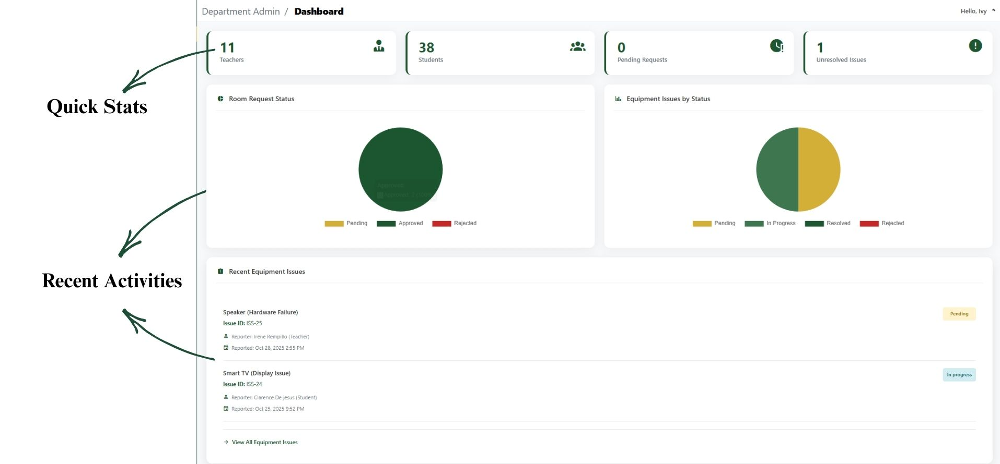

# Admin Dashboard

### Your Admin Dashboard

When you log in, you'll see your comprehensive dashboard featuring:

#### Quick Stats Cards

* Log in with your Department Admin account.
* Open the Dashboard and review Quick Stats (Total Rooms request, Active Reservations, Equipment Issues, Pending Approvals and Generate Report).
* Check Recent Activity and Pending Approvals first thing each day.
* Respond to urgent equipment reports and reservation conflicts within an hours during business hours.

### Dashboard Visual Guide

**Quick Stats -** Displays Total summary of important system data.

&#x20;**Equipment Issues Activities** - Displays recent equipment issues.

<figure><figcaption></figcaption></figure>

**Recent Room Usage** - Shows the latest room activities.\

<figure><figcaption></figcaption></figure>

<figure><figcaption></figcaption></figure>

**Generate Report**  - create detailed reports.

<figure><figcaption></figcaption></figure>
