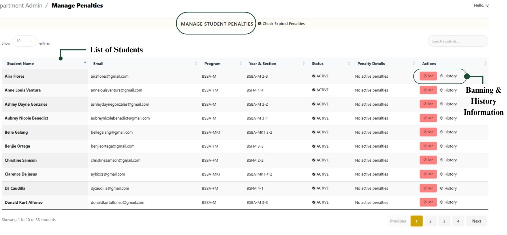

# Penalties

**View List of students.**

<figure><figcaption></figcaption></figure>

**Banning Student View**

* Click **Ban** to record a new violation and Fill in details: Reason for banning, Details and Banned expiratio&#x6E;_._ Once banned the Students, the Student dashboard notify that the user is banned and cant reserve a room.

<figure><figcaption></figcaption></figure>

**History View**

* View record/History of previous **violations** (missed bookings, misuse of rooms, etc.).

<figure><figcaption></figcaption></figure>
