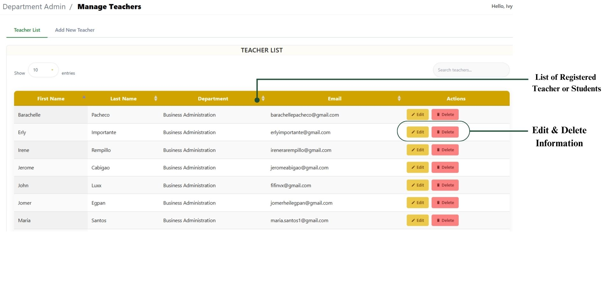
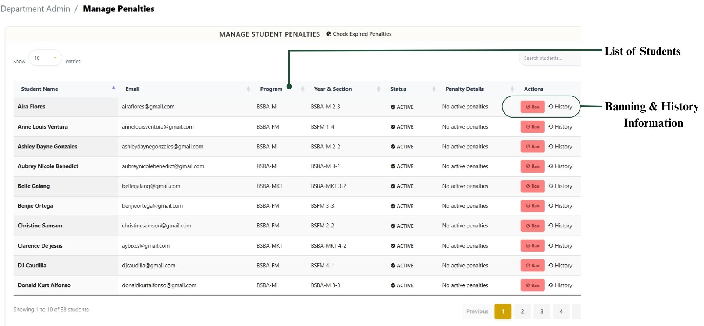

# User Management

### User Management

To manage students and teachers under your department.

* View all registered users (students and teachers).
* To manage an Account: Edit Information either Student or Teacher
* Fil name, email, department. Assign initial password.&#x20;
* Disable access for inactive or violators users.

### User Management Visual Guide

User Management Navigation Buttons

<figure><figcaption></figcaption></figure>

Manage Teachers / Students

<figure><figcaption></figcaption></figure>

Add Teacher / Students

<figure><figcaption></figcaption></figure>

### Penalties

**Penalties**  records rule violations and allows admins to issue or track penalties to ensure proper use of rooms and equipment.

Manage Students Penalties

* View record/History of previous **violations** (missed bookings, misuse of rooms, etc.).
* Click **Ban** to record a new violation and Fill in details: Reason for banning, Details and Banned expiratio&#x6E;_._
* Once banned the Students the Student dashboard notify that the user is banned and cant reserve a room.

<figure><figcaption></figcaption></figure>
