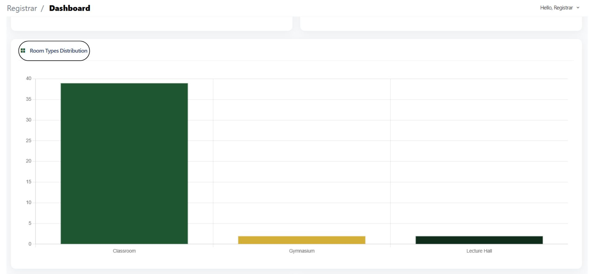

# Registrar Dashboard Guide

### Your Registrar Dashboard

Upon logging in, you’ll see your Registrar Dashboard, which includes:

* **Total Buildings** - Displays the number of active buildings
* **Total Rooms** - Counts all classrooms, labs, and facilities
* **Total Equipment -** Indicates the total number of reported equipment problems that are not yet resolved.
* **Total Departments** - Displays the number of active departments currently managed in the system.

<figure><figcaption></figcaption></figure>

**Room Status Distribution** - Shows the breakdown of rooms by their current status (e.g., _Available_, _Occupied_, _Under Maintenance_)

**Equipment Status Distribution -** Displays the proportion of equipment based on their condition.

<figure><figcaption></figcaption></figure>

**Room Types Distribution -** Displays the proportion of different room types

<figure><figcaption></figcaption></figure>

**Largest Buildings -** Highlights the campus buildings with the highest number of rooms or facilities, giving you a quick view of which areas accommodate the most activities.

**Recent Equipment  Issues -** Displays the latest reported equipment problems, allowing quick monitoring and timely response to maintenance concerns.

<figure><figcaption></figcaption></figure>

**Rooms by Department -** Shows the number of rooms assigned to each department

<figure><figcaption></figcaption></figure>
