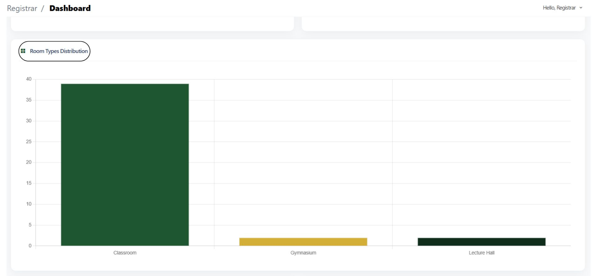

# Super Admin Dashboard Guide

### Your Registrar Dashboard

Upon logging in, you’ll see your Registrar Dashboard, which includes:

* Total Buildings — Displays the number of active buildings
* Total Rooms — Counts all classrooms, labs, and facilities
* Department Admins — Lists all current department administrators
* Active Users — Shows the total active student and teacher accounts

Recent Activity Logs — Displays the latest updates in reservations, equipment, and user actions

### &#x20;Dashboard Visual Guide

<figure><figcaption></figcaption></figure>

<figure><figcaption></figcaption></figure>

<figure><figcaption></figcaption></figure>

<figure><figcaption></figcaption></figure>

<figure><figcaption></figcaption></figure>
