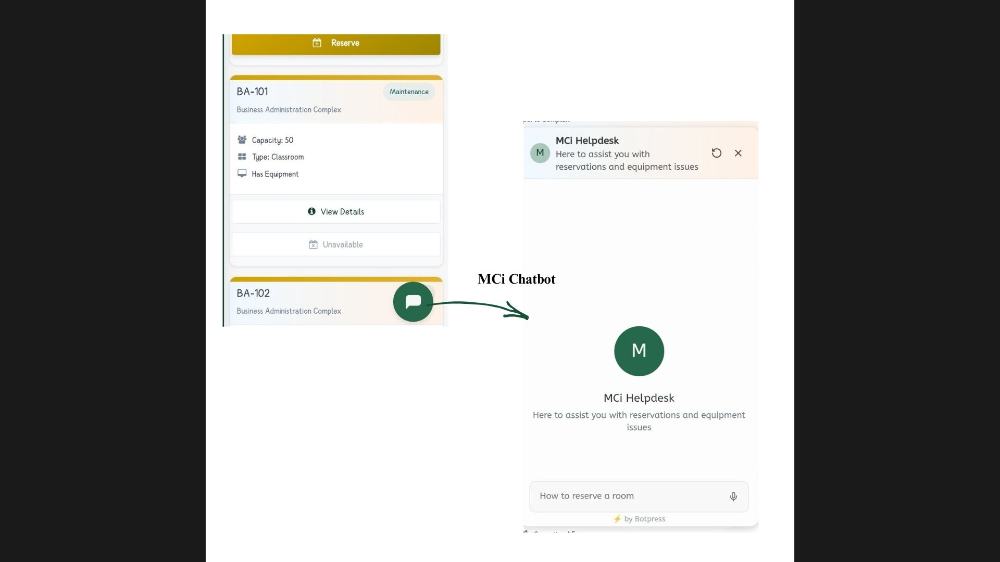

# Profile Management

#### **Steps to Manage Your Profile**

* Click **Profile** in the upper-right corner of your dashboard.
* you'll see your Account Status
* Review your current personal details Including **Name**, **Email**, and **Department**.
* Click **Edit Profile** to make any changes.
* Update your information or change your password as needed.
*   Click Update and A success message will confirm your update .

### Profile Management Visual Guide&#x20;

**Edit Profile View**

<figure><figcaption></figcaption></figure>

**Account Status View**

<figure><figcaption></figcaption></figure>

**Personal Information View**

<figure><figcaption></figcaption></figure>

**Change Information (if needed)**

<figure><figcaption></figcaption></figure>

#### **MC CHATBOT**

**MCiSmartSpace Chatbot** is built-in digital assistant designed to help you navigate the system easily.

* Click the **Chatbot Icon** at the bottom-right corner of your dashboard.
* Type your question like "how to reserve a room".&#x20;
* The chatbot will respond with clear guidance and answer to your questions immediately.

<figure><figcaption></figcaption></figure>
