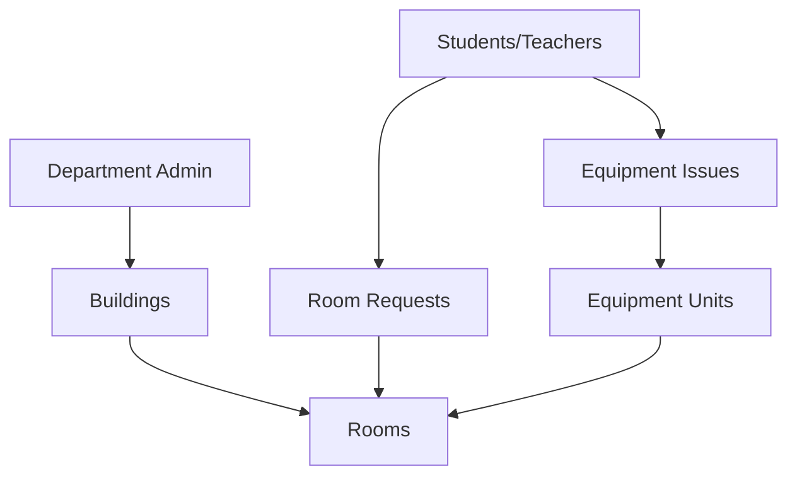

# Database Schema Documentation

This document provides a comprehensive overview of the MCiSmartSpace database structure, including tables, relationships, and key constraints.

## Database Overview

MCiSmartSpace uses a MySQL database with a normalized relational structure designed for:
- **Data Integrity** - Foreign key constraints ensure referential integrity
- **Performance** - Proper indexing for fast queries
- **Scalability** - Structure supports growth and expansion
- **Security** - Role-based access control and data isolation

## Core Tables

### User Management Tables

#### `registrar`
System administrators with highest level access.

```sql
CREATE TABLE registrar (
    regid INT PRIMARY KEY AUTO_INCREMENT,
    Reg_Email VARCHAR(255) UNIQUE NOT NULL,
    Reg_Password VARCHAR(255) NOT NULL,
    RoleID INT DEFAULT 1,
    created_at TIMESTAMP DEFAULT CURRENT_TIMESTAMP
);
```

**Key Fields:**
- `regid` - Primary key, unique registrar identifier
- `Reg_Email` - Login email address
- `Reg_Password` - Plain text password (legacy, should be hashed)
- `RoleID` - Role identifier (always 1 for registrars)

#### `dept_admin`
Department administrators with department-level access.

```sql
CREATE TABLE dept_admin (
    AdminID INT PRIMARY KEY AUTO_INCREMENT,
    FirstName VARCHAR(100) NOT NULL,
    LastName VARCHAR(100) NOT NULL,
    Email VARCHAR(255) UNIQUE NOT NULL,
    Password VARCHAR(255) NOT NULL,
    Department VARCHAR(100) NOT NULL,
    created_at TIMESTAMP DEFAULT CURRENT_TIMESTAMP,
    updated_at TIMESTAMP DEFAULT CURRENT_TIMESTAMP ON UPDATE CURRENT_TIMESTAMP
);
```

**Key Fields:**
- `AdminID` - Primary key, unique admin identifier
- `Email` - Login email address
- `Password` - Hashed password using bcrypt
- `Department` - Department assignment for access control

#### `teacher`
Faculty members with teaching privileges.

```sql
CREATE TABLE teacher (
    TeacherID INT PRIMARY KEY AUTO_INCREMENT,
    FirstName VARCHAR(100) NOT NULL,
    LastName VARCHAR(100),
    Email VARCHAR(255) UNIQUE NOT NULL,
    Password VARCHAR(255) NOT NULL,
    Department VARCHAR(100),
    created_at TIMESTAMP DEFAULT CURRENT_TIMESTAMP
);
```

#### `student`
Student users with basic access privileges.

```sql
CREATE TABLE student (
    StudentID INT PRIMARY KEY AUTO_INCREMENT,
    FirstName VARCHAR(100) NOT NULL,
    LastName VARCHAR(100),
    Email VARCHAR(255) UNIQUE NOT NULL,
    Password VARCHAR(255) NOT NULL,
    Department VARCHAR(100),
    created_at TIMESTAMP DEFAULT CURRENT_TIMESTAMP
);
```

### Infrastructure Tables

#### `buildings`
Physical buildings on campus.

```sql
CREATE TABLE buildings (
    id INT PRIMARY KEY AUTO_INCREMENT,
    building_name VARCHAR(255) NOT NULL,
    department VARCHAR(100) NOT NULL,
    number_of_floors INT DEFAULT 1,
    created_at TIMESTAMP DEFAULT CURRENT_TIMESTAMP
);
```

**Key Fields:**
- `building_name` - Official building name
- `department` - Department that manages the building
- `number_of_floors` - Physical structure information

**Sample Data:**
- Accountancy Building (Accountancy)
- Business Administration Complex (Business Administration)
- Criminal Justice Building (Criminal Justice)
- Education and Arts Building (Education and Arts)
- Hospitality Management Building (Hospitality Management)

#### `rooms`
Individual rooms within buildings.

```sql
CREATE TABLE rooms (
    id INT PRIMARY KEY AUTO_INCREMENT,
    room_name VARCHAR(100) NOT NULL,
    room_type VARCHAR(50) DEFAULT 'Classroom',
    capacity INT NOT NULL,
    building_id INT NOT NULL,
    created_at TIMESTAMP DEFAULT CURRENT_TIMESTAMP,
    FOREIGN KEY (building_id) REFERENCES buildings(id) ON DELETE CASCADE
);
```

**Key Fields:**
- `room_name` - Unique room identifier (e.g., ACC-101, BA-202)
- `room_type` - Classification (Classroom, Laboratory, Conference Room, etc.)
- `capacity` - Maximum occupancy for safety and planning
- `building_id` - Foreign key to buildings table

**Room Naming Convention:**
- **ACC-101** - Accountancy Building, Room 101
- **BA-202** - Business Administration, Room 202
- **CJ-103** - Criminal Justice Building, Room 103

### Equipment Management Tables

#### `equipment`
Equipment type definitions.

```sql
CREATE TABLE equipment (
    id INT PRIMARY KEY AUTO_INCREMENT,
    name VARCHAR(255) NOT NULL,
    description TEXT,
    category VARCHAR(100),
    created_at TIMESTAMP DEFAULT CURRENT_TIMESTAMP
);
```

**Key Fields:**
- `name` - Equipment type name (e.g., Smart TV, Projector)
- `description` - Detailed description of equipment
- `category` - Classification (Electronics, Audio Equipment, Appliances, etc.)

**Equipment Categories:**
- **Electronics** - TVs, projectors, computers
- **Audio Equipment** - Speakers, microphones, sound systems
- **Appliances** - Air conditioners, fans, refrigerators
- **Accessories** - Cables, remotes, adapters
- **Teaching Materials** - Specialized educational equipment

#### `equipment_units`
Individual equipment instances assigned to rooms.

```sql
CREATE TABLE equipment_units (
    id INT PRIMARY KEY AUTO_INCREMENT,
    equipment_id INT NOT NULL,
    room_id INT,
    serial_number VARCHAR(255) UNIQUE,
    status ENUM('working', 'needs_repair', 'out_of_service') DEFAULT 'working',
    purchased_at DATE,
    notes TEXT,
    created_at TIMESTAMP DEFAULT CURRENT_TIMESTAMP,
    FOREIGN KEY (equipment_id) REFERENCES equipment(id) ON DELETE CASCADE,
    FOREIGN KEY (room_id) REFERENCES rooms(id) ON DELETE SET NULL
);
```

**Key Fields:**
- `equipment_id` - Foreign key to equipment table
- `room_id` - Foreign key to rooms table (nullable for unassigned equipment)
- `serial_number` - Unique identifier for tracking
- `status` - Current condition (working, needs_repair, out_of_service)
- `purchased_at` - Purchase date for warranty and lifecycle tracking

### Reservation System Tables

#### `room_requests`
Room reservation requests from users.

```sql
CREATE TABLE room_requests (
    RequestID INT PRIMARY KEY AUTO_INCREMENT,
    StudentID INT,
    TeacherID INT,
    RoomID INT NOT NULL,
    ActivityName VARCHAR(255) NOT NULL,
    Purpose TEXT,
    ReservationDate DATE NOT NULL,
    StartTime TIME NOT NULL,
    EndTime TIME NOT NULL,
    Participants INT NOT NULL,
    Status ENUM('pending', 'approved', 'rejected') DEFAULT 'pending',
    RequestDate TIMESTAMP DEFAULT CURRENT_TIMESTAMP,
    ApprovedBy INT,
    ApprovalDate TIMESTAMP NULL,
    RejectionReason TEXT,
    FOREIGN KEY (StudentID) REFERENCES student(StudentID) ON DELETE CASCADE,
    FOREIGN KEY (TeacherID) REFERENCES teacher(TeacherID) ON DELETE CASCADE,
    FOREIGN KEY (RoomID) REFERENCES rooms(id) ON DELETE CASCADE,
    FOREIGN KEY (ApprovedBy) REFERENCES dept_admin(AdminID) ON DELETE SET NULL
);
```

**Key Fields:**
- `StudentID` / `TeacherID` - Requester (one will be NULL)
- `RoomID` - Requested room
- `ActivityName` - Name of the activity
- `Purpose` - Detailed description of intended use
- `ReservationDate` - Date of the reservation
- `StartTime` / `EndTime` - Time range for reservation
- `Participants` - Number of people attending
- `Status` - Current approval status
- `ApprovedBy` - Department admin who approved/rejected

### Issue Tracking Tables

#### `equipment_issues`
Equipment problem reports from users.

```sql
CREATE TABLE equipment_issues (
    id INT PRIMARY KEY AUTO_INCREMENT,
    student_id INT,
    teacher_id INT,
    equipment_unit_id INT NOT NULL,
    issue_description TEXT NOT NULL,
    issue_category VARCHAR(100),
    priority ENUM('low', 'medium', 'high', 'critical') DEFAULT 'medium',
    status ENUM('pending', 'in_progress', 'resolved', 'rejected') DEFAULT 'pending',
    photos TEXT, -- JSON array of photo URLs
    reported_at TIMESTAMP DEFAULT CURRENT_TIMESTAMP,
    resolved_at TIMESTAMP NULL,
    resolution_notes TEXT,
    FOREIGN KEY (student_id) REFERENCES student(StudentID) ON DELETE CASCADE,
    FOREIGN KEY (teacher_id) REFERENCES teacher(TeacherID) ON DELETE CASCADE,
    FOREIGN KEY (equipment_unit_id) REFERENCES equipment_units(id) ON DELETE CASCADE
);
```

**Key Fields:**
- `student_id` / `teacher_id` - Reporter (one will be NULL)
- `equipment_unit_id` - Specific equipment unit with the issue
- `issue_description` - Detailed problem description
- `issue_category` - Type of problem
- `priority` - Urgency level
- `status` - Current resolution status
- `photos` - JSON array of uploaded photo URLs

### System Configuration Tables

#### `system_settings`
System-wide configuration parameters.

```sql
CREATE TABLE system_settings (
    id INT PRIMARY KEY AUTO_INCREMENT,
    setting_key VARCHAR(255) UNIQUE NOT NULL,
    setting_value TEXT,
    updated_at TIMESTAMP DEFAULT CURRENT_TIMESTAMP ON UPDATE CURRENT_TIMESTAMP
);
```

**Key Settings:**
- `room_status_last_check` - Last time room status was updated
- `notification_settings` - Email/SMS notification configuration
- `maintenance_mode` - System maintenance status

## Key Relationships

### User-Department Relationships


### Access Control Flow
1. **Buildings** belong to **Departments**
2. **Department Admins** manage buildings in their department
3. **Students/Teachers** can only access rooms in their department
4. **Room Requests** are approved by department admins
5. **Equipment Issues** are managed by department admins

### Data Isolation
- **Department-based filtering** ensures users only see their department's data
- **Foreign key constraints** maintain referential integrity
- **Cascade deletes** handle related record cleanup
- **NULL handling** for optional relationships

## Performance Considerations

### Indexing Strategy

#### Primary Indexes
- All tables have primary key indexes (automatic)
- Unique constraints create indexes on email fields

#### Recommended Additional Indexes
```sql
-- User lookup optimization
CREATE INDEX idx_student_email ON student(Email);
CREATE INDEX idx_teacher_email ON teacher(Email);
CREATE INDEX idx_dept_admin_email ON dept_admin(Email);

-- Department filtering
CREATE INDEX idx_student_department ON student(Department);
CREATE INDEX idx_teacher_department ON teacher(Department);
CREATE INDEX idx_buildings_department ON buildings(department);

-- Room reservation queries
CREATE INDEX idx_room_requests_date ON room_requests(ReservationDate);
CREATE INDEX idx_room_requests_status ON room_requests(Status);
CREATE INDEX idx_room_requests_room ON room_requests(RoomID);

-- Equipment issue tracking
CREATE INDEX idx_equipment_issues_status ON equipment_issues(status);
CREATE INDEX idx_equipment_issues_reported ON equipment_issues(reported_at);

-- Equipment assignment
CREATE INDEX idx_equipment_units_room ON equipment_units(room_id);
CREATE INDEX idx_equipment_units_status ON equipment_units(status);
```

### Query Optimization

#### Common Query Patterns
1. **Department Filtering** - Most queries filter by user's department
2. **Date Range Queries** - Reports often query by date ranges
3. **Status Filtering** - Equipment and reservation status queries
4. **JOIN Operations** - Complex queries join multiple tables

#### Optimization Techniques
- **Use prepared statements** for security and performance
- **Limit result sets** with appropriate WHERE clauses
- **Use appropriate JOIN types** (INNER vs LEFT JOIN)
- **Consider query caching** for frequently accessed data

## Security Considerations

### Data Protection
- **Password Hashing** - Use bcrypt for all new passwords
- **SQL Injection Prevention** - Use prepared statements exclusively
- **Access Control** - Implement role-based permissions
- **Data Validation** - Validate all input data

### Privacy Compliance
- **Data Minimization** - Store only necessary information
- **Access Logging** - Track who accesses what data
- **Data Retention** - Implement appropriate retention policies
- **User Consent** - Ensure proper consent for data collection

## Migration and Maintenance

### Schema Updates
- **Version Control** - Track all schema changes
- **Migration Scripts** - Automate database updates
- **Backup Strategy** - Regular backups before changes
- **Rollback Plans** - Prepare for update failures

### Data Maintenance
- **Regular Cleanup** - Remove old, unnecessary data
- **Index Maintenance** - Monitor and optimize indexes
- **Performance Monitoring** - Track query performance
- **Capacity Planning** - Monitor storage growth

## Sample Queries

### Common Administrative Queries

#### Get all rooms in a department
```sql
SELECT r.room_name, r.room_type, r.capacity, b.building_name
FROM rooms r
JOIN buildings b ON r.building_id = b.id
WHERE b.department = 'Criminal Justice'
ORDER BY r.room_name;
```

#### Room utilization report
```sql
SELECT 
    r.room_name,
    r.room_type,
    r.capacity,
    COUNT(rr.RequestID) as total_reservations,
    CASE 
        WHEN COUNT(rr.RequestID) = 0 THEN 'Unused'
        WHEN COUNT(CASE WHEN rr.Status = 'approved' THEN 1 END) = 0 THEN 'No Approvals'
        ELSE 'Active'
    END as usage_status
FROM rooms r
JOIN buildings b ON r.building_id = b.id
LEFT JOIN room_requests rr ON r.id = rr.RoomID 
    AND rr.ReservationDate BETWEEN '2025-01-01' AND '2025-12-31'
WHERE b.department = 'Criminal Justice'
GROUP BY r.id, r.room_name, r.room_type, r.capacity
ORDER BY r.room_name;
```

#### Equipment status by department
```sql
SELECT 
    e.name as equipment_name,
    e.category,
    COUNT(eu.id) as total_units,
    COUNT(CASE WHEN eu.status = 'working' THEN 1 END) as working_units,
    COUNT(CASE WHEN eu.status != 'working' THEN 1 END) as problem_units
FROM equipment e
LEFT JOIN equipment_units eu ON e.id = eu.equipment_id
LEFT JOIN rooms r ON eu.room_id = r.id
LEFT JOIN buildings b ON r.building_id = b.id
WHERE b.department = 'Criminal Justice' OR b.department IS NULL
GROUP BY e.id, e.name, e.category
ORDER BY e.name;
```

---

## Database Support

For database-related questions, schema modifications, or performance issues:

- **Database Administrator** - Primary contact for schema changes
- **Development Team** - For application-level database questions
- **System Administrator** - For database server and infrastructure issues

**Next Steps**: Review [API Documentation](api-documentation.md) for application integration details or [Installation Guide](installation.md) for setup procedures.
